 # TaskPro

**TaskPro** is a platform for task and project management that provides a variety of features for organizing and coordinating work. 

**Boards:** The application allows you to create boards for organizing projects or tasks. On the boards, you can create different lists, cards, and labels to order and classify tasks. 
 
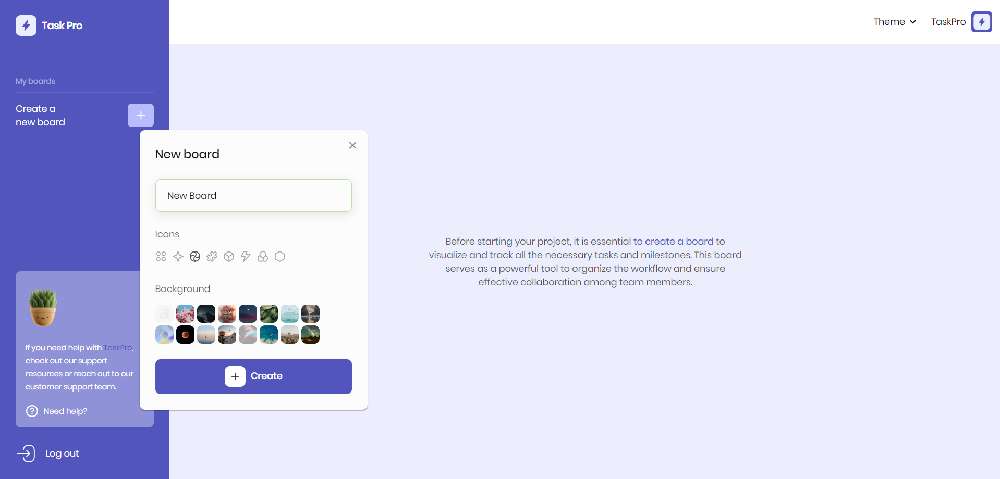
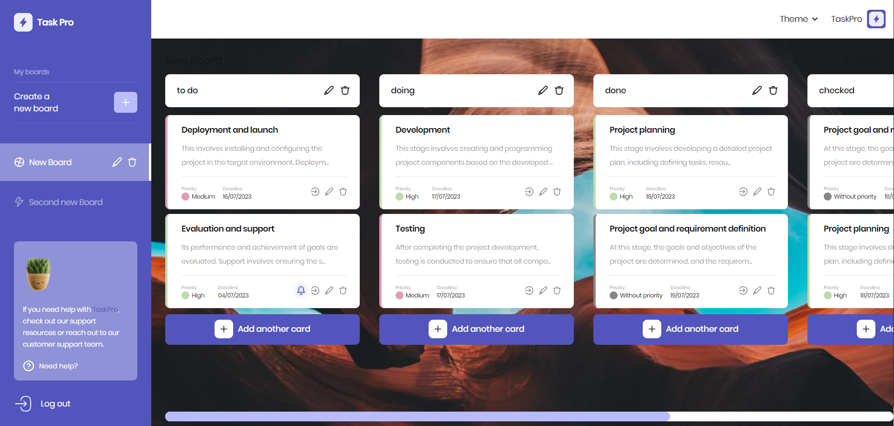

**Lists:** Within each board, you can create lists that represent stages or categories of a project. For example, you can create lists such as "In Progress," "Completed," and "Awaiting Review." 

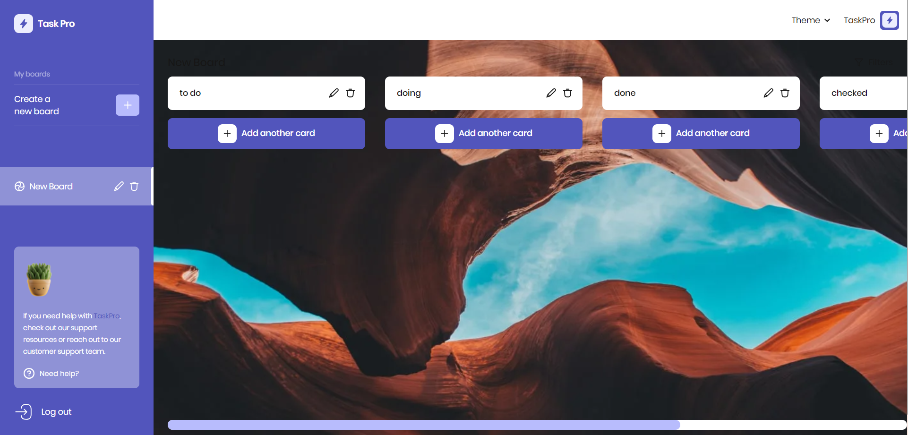

**Tasks:** In each list, you can create task cards. Cards represent individual tasks or project items that can be assigned titles, descriptions, dates, labels, attachments, and other properties.

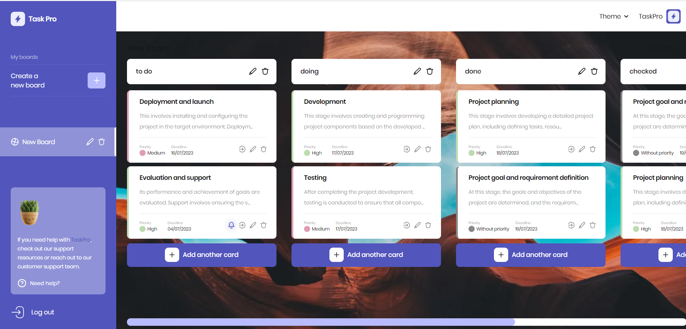
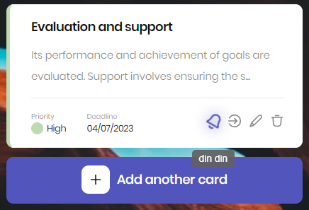

**Deadlines and Notifications:** You can set deadlines for each card or task, and TaskPro will notify you of upcoming or overdue deadlines.

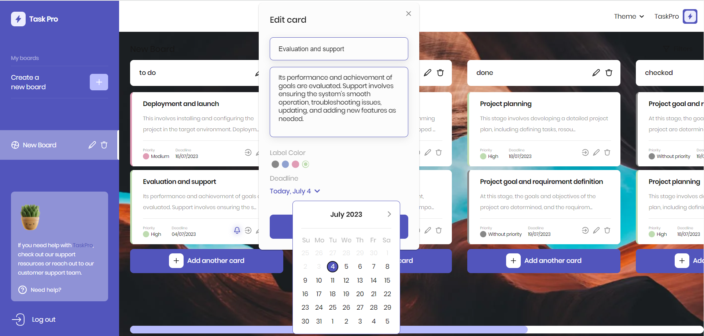
 
**Labels and Colors:** You can use labels and colors to classify and visually display tasks. For example, you can create labels for priorities and sort tasks based on these priorities.

 
**Drag and Drop Cards:** TaskPro provides an easy way to move cards between lists and boards by dragging and dropping. This allows you to easily change the status of a task or move them between different stages of a project.

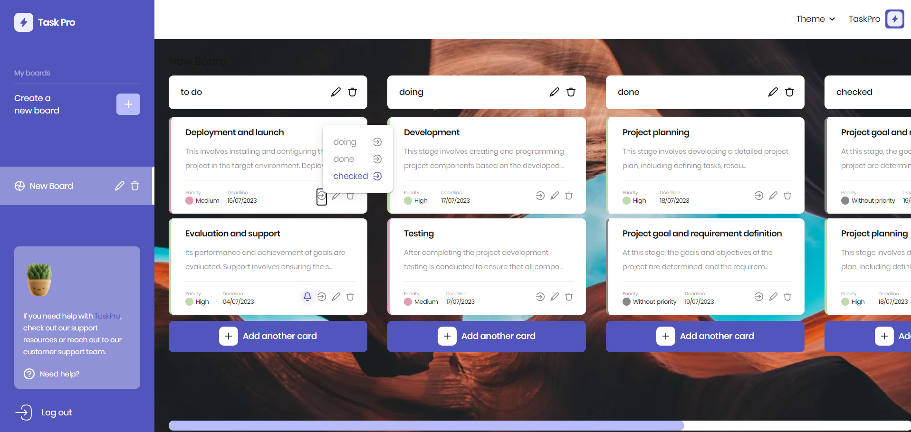
 
**Theme customization:** You can choose one of the three available themes: dark, to create a working atmosphere during nighttime or for those who prefer dark colors; light, for bright and energetic styling; and purple, to add a touch of style and elegance to your workspace.

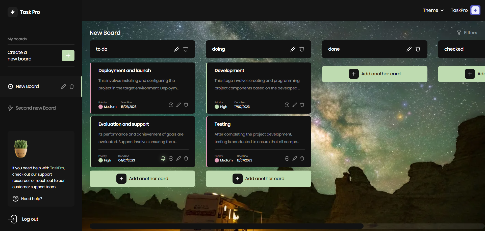
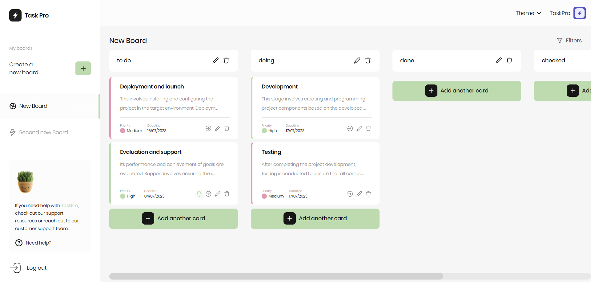
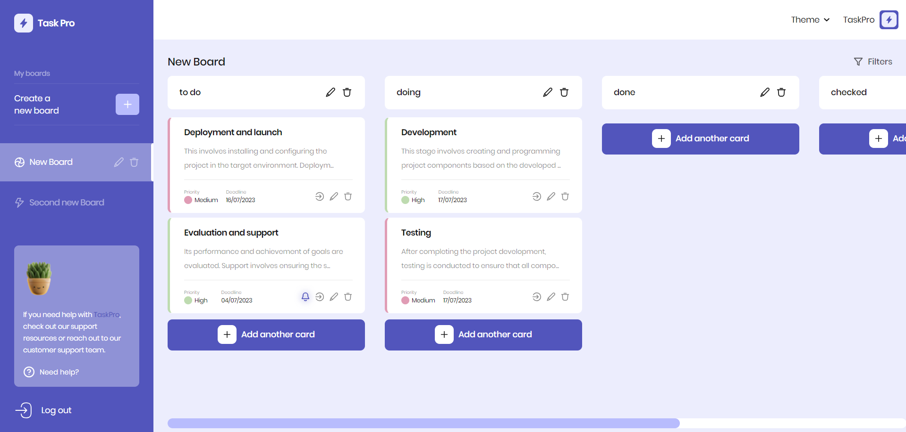

**Board background customization:** Add individuality and style to your boards by changing the background. Now you can choose from a variety of background images to create an atmosphere that suits your preferences or the nature of your project. Personalize each board and make them unique.

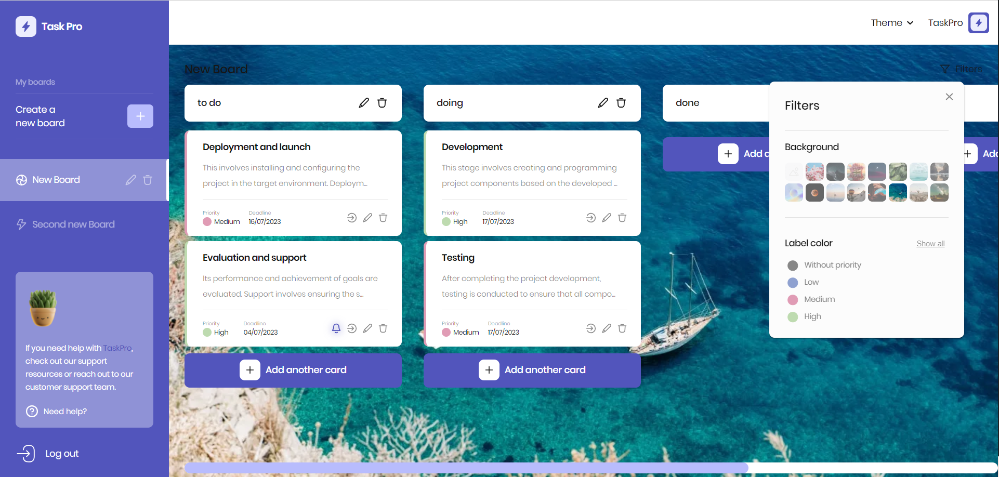
 
**Responsive design and mobile support:** TaskPro is responsive and adapted for use on various devices. You can easily work with it on mobile phones, tablets, and PCs wherever you are comfortable.

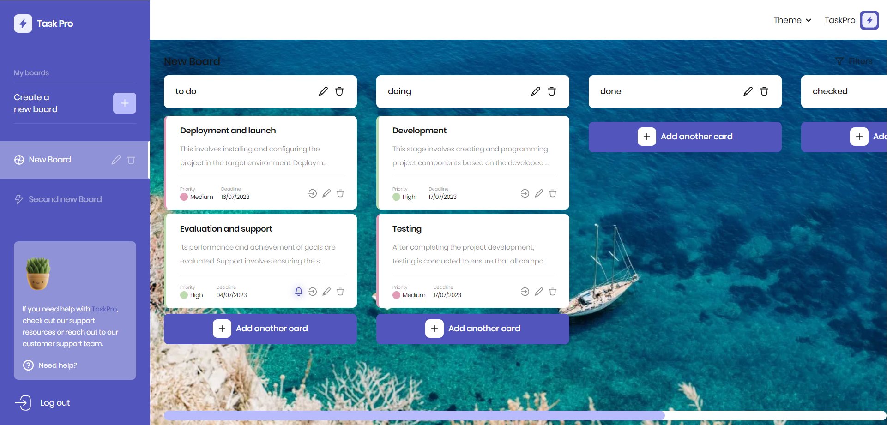
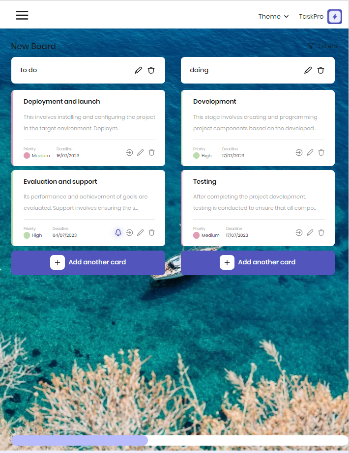
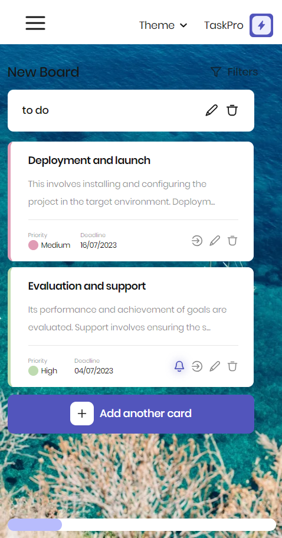
    
**User profile editing:** There is also the option to customize and enhance your profile in TaskPro. Change your name and add a profile picture. 

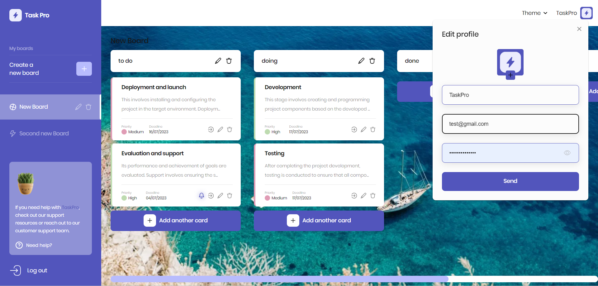

 # Installation
1. Clone the repository: git clone https://github.com/ukrwebprom/TaskPro/tree/main 
2. Navigate to the project directory: cd TaskPro 
3. Install dependencies: npm install

**Usage:**
1. Run the project: npm start 
2. Open a browser and go to: http://localhost:3000

**Technologies:**
•	React
•	Redux
•	React Router
•	Material-UI
•	Axios
•	Formik
•	Moment.js
•	Beautiful React DND
•	and others.

**Authors:**
https://www.linkedin.com/in/yuri-pochtennykh/
https://www.linkedin.com/in/vadym-popov/
https://www.linkedin.com/in/anastasiya-kor/
https://www.linkedin.com/in/yuri-pochtennykh/
https://www.linkedin.com/in/volodymyr-mospan/
https://www.linkedin.com/in/katherina-fanina/
https://www.linkedin.com/in/zoya-bukhantseva/
https://www.linkedin.com/in/anton-tsylepa/
https://www.linkedin.com/in/oleksii-stotskyi-397951265/
https://www.linkedin.com/in/vasyl-p-73246057
https://www.linkedin.com/in/serhiy-danylko-378833209/
https://www.linkedin.com/in/rostyslav-kryvovyaz/
http://linkedin.com/in/руслан-самігулін-7b61807a
https://www.linkedin.com/in/tetiana-mienkova/

**Acknowledgments:**
We would like to thank GOIT for their valuable advice, support, and contribution to the project: 
https://goit.global/ua/
# BackEnd
Here are the backend endpoints
https://taskpro-41yf.onrender.com/api-docs/